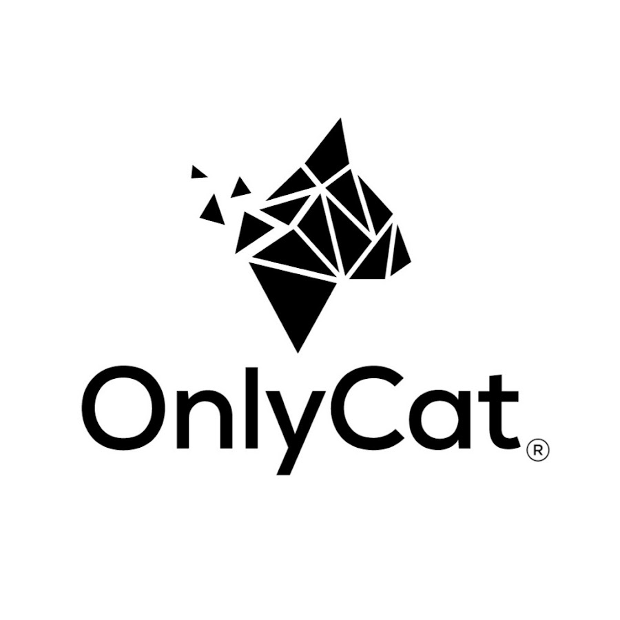

<p align="center">
  
</p>

# Homebridge-OnlyCat

Homebridge plugin for the [OnlyCat](https://www.onlycat.com) smart cat flap.

The plugin exposes each OnlyCat flap as a native HomeKit accessory:

- **Camera** — snapshot, live view, and HomeKit Secure Video recordings of every flap event
- **Per-cat presence sensors** — one HomeKit occupancy sensor per RFID profile, accurately driven by OnlyCat's `getEventSummary` so a peeking cat does not flip presence
- **Contraband alarm** — a separate occupancy sensor that fires when the flap detects unwanted prey
- **Human-activity sensor** — useful for "someone at the cat flap" notifications
- **Breach sensor** — security alarm that fires when the lock was engaged but a cat got through anyway
- **Blocked sensor** — fires when the door policy denies a cat (handy for "unknown cat tried to enter" notifications)
- **Online sensor** — fires automations when the flap loses or regains its connection to the OnlyCat gateway
- **Door-policy lock** — control the active transit policy from the Home app or via Siri
- **Remote unlock** and **reboot** as momentary switches

## Requirements

- Node.js 18.20+, 20.15+, or 22+ (Node 22+ recommended for the bundled ffmpeg)
- Homebridge 1.8+ (HomeKit Secure Video also requires an iCloud+ subscription on your Apple home hub)
- An OnlyCat account with at least one flap, plus an API token from the OnlyCat mobile app

A pre-built `ffmpeg` ships with the plugin via [`ffmpeg-for-homebridge`](https://github.com/homebridge/ffmpeg-for-homebridge), so you don't need to install it yourself. If you'd rather use a custom ffmpeg build, set `ffmpegPath` in the plugin config to its absolute path.

## Install

The easiest path is the Homebridge UI: search for **OnlyCat** in the plugins tab and install it.

For a manual install:

```sh
sudo npm install -g homebridge-onlycat
```

## Configuration

Use the Homebridge UI's settings form, or add the platform block to your `config.json`:

```json
{
  "platforms": [
    {
      "platform": "OnlyCat",
      "name": "OnlyCat",
      "token": "YOUR_ONLYCAT_TOKEN",
      "debug": false
    }
  ]
}
```

| Field | Type | Required | Description |
|-------|------|----------|-------------|
| `platform` | string | yes | Must be `OnlyCat` |
| `name` | string | yes | Display name in Homebridge logs |
| `token` | string | yes | API token issued by the OnlyCat mobile app |
| `debug` | boolean | no | Verbose logging — leave off for normal use |
| `replayHistoryOnStartup` | integer (0–30) | no | When > 0, replay the last N days of events through HKSV on startup. The clip content is correct, but HomeKit will timestamp the recordings at the moment of replay — Apple's HKSV API does not allow backdating. Default `0` (off). |

### Getting your OnlyCat API token

1. Open the OnlyCat mobile app
2. Go to **Settings → Developer**
3. Generate (or copy) your API token
4. Paste it into the plugin configuration

The token authenticates the plugin against `gateway.onlycat.com`. Treat it like a password — anyone with the token can control your flap.

## How it works

Once configured, the plugin opens a single persistent WebSocket (Socket.IO) connection to OnlyCat's gateway. It:

1. Discovers every flap on your account and registers a HomeKit camera accessory for each one.
2. Subscribes to live event updates. Every flap event triggers the matching HomeKit sensors and, if HKSV is enabled, records a clip to your Home timeline.
3. Discovers known cats from RFID profiles and registers a presence sensor accessory per cat.
4. Reflects the current door policy as a HomeKit lock; toggling the lock activates a different transit policy.

For a deeper dive into the architecture see [`docs/ARCHITECTURE.md`](docs/ARCHITECTURE.md).

## Privacy & security

- The token is stored only in your Homebridge `config.json` and is never logged or transmitted anywhere except OnlyCat's official gateway.
- All traffic is HTTPS / WSS to `gateway.onlycat.com`.
- Snapshots and HKSV clips stay on your Apple devices via iCloud — they never pass through any third-party server.
- See [`SECURITY.md`](SECURITY.md) for the full threat model and how to report a vulnerability.

## Contributing

See [`CONTRIBUTING.md`](CONTRIBUTING.md). Bug reports and pull requests are welcome.

## Disclaimer

This project is not affiliated with or endorsed by OnlyCat. *OnlyCat® is a registered trademark of VirtualV Trading Ltd.*

## License

MIT — see [`LICENSE`](LICENSE).
